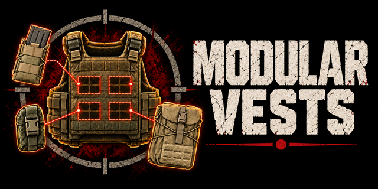

# Modular Vests – MOLLE chest rigs with attachable pouches for SPT



**Modular Vests** adds modular chest rigs to **SPT (Single Player Tarkov)** 4.1, the offline
Escape From Tarkov project: a rig carries no pockets of its own, only MOLLE webbing.
Storage comes from pouches attached to it on the **Modding** screen, and the rig window
shows the grids of every attached pouch.

> ## ⚠ REQUIRES WTT-CONTENTBACKPORT
>
> **[WTT-ContentBackport](https://forge.sp-tarkov.com/) is mandatory, not optional.** The rigs
> are built on its templates and models. Install it first: without it the mod registers
> nothing at all — no rigs, no pouches, no trader — and says so in the server log.

## The line-up

Ten carriers, each in the same five colours as the pouches — Coyote, Olive, MultiCam, Black
and EMR — so a rig and the pouches on it match. Fifty rigs in all.

Four clusters of 2x2 pouch cells each, chest left and right and cummerbund left and right:

- **6B45 modular rig**;
- **IOTV Gen4 modular rig** in three kits — Full Protection, Assault, High Mobility;
- **FORT Gladiator-S**, **6B43 Zabralo-Sh**, **NFM THOR Integrated Carrier** and
  **MF-UNTAR** modular rigs.

Two clusters, on the chest, because the carrier has no cummerbund:

- **HighCom Trooper TFO** and **Interceptor OTV** modular rigs.

Each rig takes the plates and the soft armor of the body armor it is made from, so it protects
the same. MF-UNTAR has no plate slots, as the vanilla one has none.

Thirteen pouches, every one of them in all five colours. "Cells" is the room a pouch takes on
the rig, "sections" the grids it gives you:

| Pouch | Cells | Sections |
|---|---|---|
| Pistol magazine pouch | 1x1 | 1x1 |
| Grenade pouch | 1x1 | 1x1 |
| Warrior grenade pouch | 1x1 | 1x1 |
| Gadget pouch | 1x2 (one column, two rows) | 1x1 + 1x1 |
| Open-top magazine pouch | 1x2 | 1x2 |
| Magazine pouch | 1x2 | 1x2 |
| Double magazine pouch | 1x2 | 1x2 + 1x2 |
| Narrow utility pouch | 1x2 | 1x2 + 1x2 |
| Bottle pouch | 1x2 | 1x2 + 1x2 |
| Admin pouch | 2x1 (two columns, one row) | 2x1 + 2x1 |
| Medical pouch | 2x2 (a whole cluster) | 2x2 |
| Utility pouch | 2x2 | 2x2 + 2x1 |
| Cargo pouch | 2x2 | 2x3 |

All of it is sold by the mod's own trader, **Anatoly** (gear workshop), at loyalty level 1 for
roubles; he buys back his own line-up, and the plates and panels that go into it — a trader can
only buy an item when it buys the parts inside it too. On the flea market a rig comes assembled,
with its soft armor, collar and plates, like any vanilla armored rig.

Insuring a rig insures the pouches on it: a lost insured rig comes back with every pouch it
carried, whether or not the pouches were insured themselves, and the trader never keeps a pouch
back. What was inside the pouches comes back only if it was insured.

## Bots and loot

Bots wear the modular rigs too. A rig turns up as often as the body armor it is built on: the
bot types that wear that armor, in the proportion they wear it. The pouches on it are rolled
per bot — magazine pouches across the chest, the rest of the chest either filled or bare, each
cummerbund empty, part full or full — in a colour matched to the rig, with the occasional pouch
out of colour. A bot reloads, tops its magazines up, throws grenades and heals out of those
pouches, and its body can be looted for them.

The rigs and the pouches also lie around the maps: containers that already hold the body armor
now hold the rig, assembled; dead scavs, dead PMCs, weapon crates and wooden crates hold single
pouches; and the maps offer rigs complete with a pouch loadout wherever the body armor lies
around. Bots carry single pouches in their backpacks.

Everything about this is a number in
`SPT_Runtime/user/mods/ModularVests/mod-files/bots.jsonc`: how often a rig turns up, how many
magazines a chest carries, how full a cummerbund is, and the loot weights. Set
`"enabled": false` there to leave bots and loot alone entirely.

## Requirements

- SPT 4.1.x
- **[WTT-ContentBackport](https://forge.sp-tarkov.com/) — mandatory.** The 6B45 and the
  Gladiator-S are built on its templates and models, and the mod registers nothing without it.
- Optional: APBS (Acid's Progressive Bot System) — when it is installed, the rigs are weighed
  into its tiers against the body armor they are built on, tier by tier. They follow its
  modded equipment switch: with `enableModdedEquipment` off, bots do not wear them.

## Installation

**Back up your profile first** (`SPT_Runtime/user/profiles`). Then unpack the archive into the
SPT root folder, so that you get:

```
BepInEx/plugins/ModularVests/ModularVests.Client.dll
BepInEx/plugins/ModularVests/bones.json
BepInEx/plugins/ModularVests/mounts.json
SPT_Runtime/user/mods/ModularVests/ModularVests.Server.dll
SPT_Runtime/user/mods/ModularVests/bundles.json
SPT_Runtime/user/mods/ModularVests/bundles/modularvests/*.bundle
SPT_Runtime/user/mods/ModularVests/mod-files/items.jsonc
SPT_Runtime/user/mods/ModularVests/mod-files/bots.jsonc
SPT_Runtime/user/mods/ModularVests/mod-files/trader/trader.jsonc
SPT_Runtime/user/mods/ModularVests/mod-files/trader/avatar.jpg
```

Removing the mod later leaves the rigs and pouches in your profile without a template:
sell or discard them before uninstalling. The trader's record (`TradersInfo`) stays in the
profile as well.

## Usage

- Buy the rig and pouches from Anatoly, equip the rig.
- Inspect the rig → **Modding**, pick a pouch for a cell (or drag a pouch onto a cell in the
  inspect window). The cells of a cluster read like a page:

  ```
  1 2
  3 4
  ```

  A pouch sits in its cell and spreads right and down from it, inside the cluster: cell 1
  takes any pouch, cell 2 a 1x2 or 1x1, cell 3 a 2x1 or 1x1, cell 4 a 1x1. The cells a
  larger pouch covers are blocked, the way a helmet blocks the headset slot; a pouch that
  would cover an occupied or already covered cell is refused, and the pouch in the way is
  highlighted.
- Open the rig: the grids of all attached pouches are laid out in centred rows, pouches of the
  same kind together. Quick move (Ctrl+click), picking up and dragging a group of items (UI
  Fixes) fill the pouches like the pockets of any rig; what does not fit in one pouch goes on
  to the next one in the rig window.
- In raid, pouches cannot be attached or removed; their contents work like rig pockets: quick
  reload, grenade selection and quick-slot binds.

## Settings (F12)

| Setting | Default | What it does |
|---|---|---|
| Enabled | on | Master switch. Takes effect on the next game start. |
| Lock pouches in raid | on | Pouches cannot be attached or detached during a raid. Their contents stay reachable either way. |
| Rig window width (cells) | 6 | The rig window lays the pouch grids out in rows no wider than this. |
| Patch self-test on load | on | Reports missing patch targets at startup, in the BepInEx log. |
| Debug log | off | Writes where the pouch bones of each rig model went. |
| Use game shader | on | Draws the pouch models with the shader of the game's own items. Takes effect on the next game start. |
| Specular, Gloss | 0.12, 0.25 | For pouch models without a specular map of their own; the mod's models have one. |
| Redraw pouch icons | — | Throws away the cached icons of the mod's items so the game draws them again. |

## Languages

English, Russian, Chinese (Simplified), Spanish, Portuguese (Brazil), German, French, Japanese,
Polish, Turkish and Korean. A language the game ships but the mod does not carry falls back to
English.

## Known limitations

- Moving an item into a pouch clears its quick-slot bind (a server rule); binding an item
  that already lies in a pouch works.
- Pouch grids are not sorted by the rig window's sort button.
- Pouch contents on a body are visible without searching.

## License

[CC BY-NC-SA 4.0](LICENSE).

## Credits

The 6B45 and the FORT Gladiator-S are built on templates and models from
**WTT-ContentBackport**; the other rigs are built on the game's own body armor, and each wears
a recoloured copy of its carrier's own texture.

